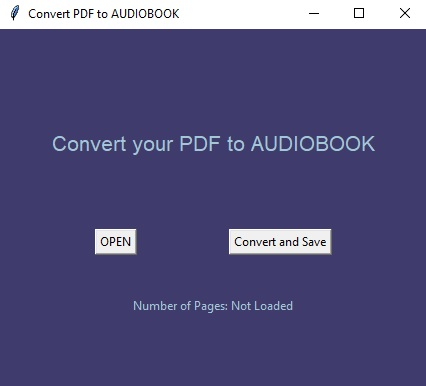

# Converter from PDF to Audiobook App, Python

* Converter where you can choose any PDF file and transform it to MP3 audio file. 
  Open button take file and loads it, after then you can Save and Convert on choisen root directory where you pick. 
  App is made in tkinter module.

* Website that gave me some inspiration:

  [PDF2MP3 Example](https://audio.online-convert.com/convert/pdf-to-mp3)

### Requirements

##### Tkinter Module:

[Tkinter docs](https://docs.python.org/3/library/tkinter.html)

##### Google Text To Speach Module:

[gTTS docs](https://gtts.readthedocs.io/en/latest/)

##### Python PDF2 Module:

[pyPDF2 docs](https://pypi.org/project/PyPDF2/)

### Usage

* Firsty we must open file, it looks only for pdf files in file explorer.
* When we choose file to open and confirm, we update label to show how many pages we got.
* Final step is to choose output directory where we want to save our converter mp3 file extension.
  

    
### Ideas for future improvements

##### This project as any other have always space for improvements.
    I use a lot ideas to practice and upgrade my skills.
    
* Improve User Interface, User Experience.
* Play button to play text before we save it.
* More padding and styling, canvas photo, etc.